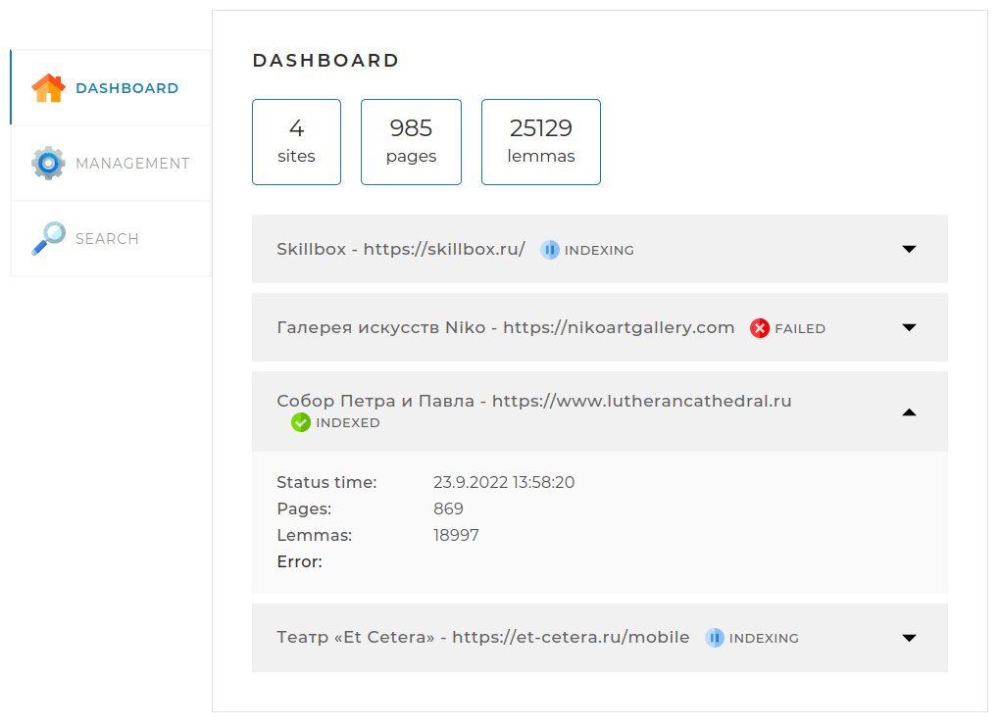
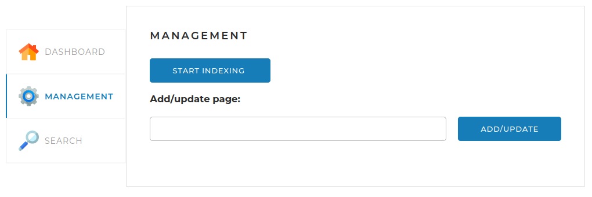
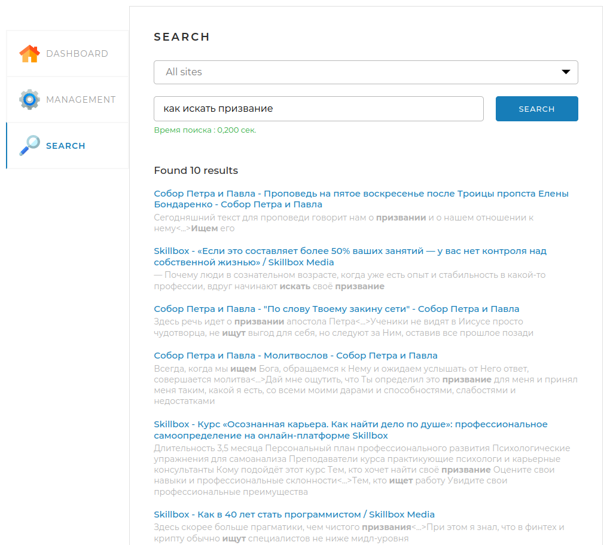

# Posik Engine Search Bot

<div align="center">
    
    <br>
    Всё найдём!
</div>

## Что это?
Это локальный поисковый движок. Можно поставить себе на компьютер, на сервер, на холодильник, главное, чтобы была Java, и он сможет индексировать сайты для поиска. Можно проиндексировать ресурсы в закрытой сети, или до которых по каким-то иным причинам не добрались большие движки. Можно даже использовать как локальный поисковый движок для своего сайта благодаря API.

А ещё это учебный проект. Делать его было интересно и познавательно.

## Зависимости
- [russianmorphology](https://github.com/AKuznetsov/russianmorphology) для морфологического анализа страниц сайтов
- [crawler-commons](https://github.com/crawler-commons/crawler-commons) используется частично для обработки файлов `robots.txt`
- [spring boot](https://spring.io/projects/spring-boot) как основной фреймворк проекта, отвечающий за управление контекстом, развёртывание, и обработку запросов
- [Junit 5](https://junit.org/junit5/docs/current/user-guide/) и [Mockito](https://site.mockito.org/) для тестирования
- [Lombok](https://projectlombok.org) чтобы меньше писать

## Как его запустить?
Для сборки понадобятся:
- **JDK 17**
- **Maven 3**

Для работы:
- **JRE 17**
- **Postgresql 42.5.0**

При сборке необходимо использовать прилагающийся файл `settings.xml`. Это необходимо для скачивания и подключения библиотеки `russianmorphology` к проекту. Можно скопировать содержимое в основной файл настроек Maven, или использовать команду для сборки:
```bash
mvn -s settings.xml clean install
```

Перед сборкой следует отредактировать файл настроек `application.yml` или скопировать его и положить рядом с исполняемым .jar файлом, что позволит менять настройки динамически, без пересборки приложения.

### Настройка приложения
Настройки подключения к базе данных задаются следующим образом:
```yaml
  datasource:
    driver-class-name: org.postgresql.Driver
    url: jdbc:postgresql://localhost:5432/search_engine
    username: search_engine
    password: posikEngine
```
Указывается драйвер подключения, параметры соединения, включая адрес, порт и имя схемы, а так же логин и пароль для доступа к БД.

В настройках Hibernate отдельного внимания заслуживает настройка `ddl-auto`, которая отвечает за пересоздание таблиц при перезапуске программы.
Возможные варианты:
- `none` не предпринимать никаких действий
- `create` создать новые таблицы при запуске, старые данные удаляются
- `create-drop` создать новые таблицы при запуске, при завершении приложения удалить их
- `validate` проверить соответствие таблиц описанным в программе сущностям
- `update` при наличии расхождений в состоянии БД и в описании сущностей в программе, обновить таблицы в БД

Для регулярной работы рекомендуется использовать флаги `none` или `update`, как вариант, вообще не использовать этот тег.

Для настройки самого поискового движка используется группа параметров `search-engine-properties`.

Для настройки имени поискового бота (Как он будет представляться сайтам в интернете) и главного адреса страницы используются параметры 
```yaml
search-engine-properties:
  user-agent: PösikEngineSearchBot
  home-page: /admin
```
Здесь же задаётся перечень сайтов, которые будут доступны для обработки и перечень классификаторов тегов html с весами:
```yaml
preload:
    sites:
      -
        url: https://nikoartgallery.com
        name: Галерея искусств Niko
    fields:
      -
        name: title
        selector: title
        weight: 1.0

```
Эта информация загружается в базу данных при запуске программы и используется при работе.

### Сборка и запуск
Как было описано выше, для сборки используется команда `mvn clean install` или `mvn -s settings.xml clean install` если необходимо подключить внешний файл с настройками.

В результате выполнения этой команды в папке `target/` в корне исходного кода, будет создан файл `posik-engine-1.2.jar`, который можно перенести в любое место и запустить с помощью команды
```bash
java -jar posik-engine-1.2.jar
```

## Работа с программой
### Веб-интерфейс
Для удобства использования программы предусмотрен веб-интерфейс. По умолчанию он доступен по адресу `\admin`. Он содержит три вкладки.
#### Dashboard


На этой вкладке содержится статистика о количестве сайтов, страниц, лемм, и статусе, в котором находятся страницы (Индексируются, проиндексированы, или в состоянии ошибки)

При просмотре детальной статистики для каждого сайта указывается дата и время последнего изменения, число страниц, число лемм и сообщение о последней ошибке, если такое есть.
#### Management


Здесь размещена кнопка `START INDEXING`. Она запускает индексацию/переиндексацию всех страниц для всех сайтов, которые ещё не индексируются в настоящий момент.

Ниже находится поле, в которое можно ввести адрес отдельной страницы для индексации/переиндексации. Если она находится на одном из сайтов, про которые программа знает, она будет обработана.

После запуска полной индексации интерфейс вкладки меняется: становится доступной только одна кнопка `STOP INDEXING`.


Она прерывает все процессы индексирования, выполняющиеся в данный момент.

#### Search
Вкладка поиска.



Поиск возможен как по всем сайтам, так и по какому-то одному. Через веб-интерфейс производится поиск 10 самых релевантных запросу страниц. Если по запросу ничего не найдено, алгоритм поиска убирает лишние слова, чтобы расширить доступные варианты.
Для поиска возможно использовать как русские, так и английские слова. Только эти языки поддерживаются механизмом индексации.

### API
Помимо работы с программой через веб-интерфейс, можно использовать REST API. Ниже приведены запросы и возможные варианты ответов.

Следует отметить что ответ об ошибке универсален и имеет следующий формат:
```json
{
   "result": false,
   "error": "сообщение об ошибке"
}
```
Ниже я не буду приводить его целиком, а буду указывать только сообщение об ошибке.

#### GET /api/startIndexing
Метод без параметров. Запускает полную индексацию или переиндексацию всех сайтов, которые не индексируются в момент запуска. Если все сайты уже индексируются, возвращает следующее сообщение об ошибке: `Индексация уже запущена`. Если произошла ошибка в логике индексирования: `Неизвестная ошибка индексирования`. При успешном запуске возвращает
```json
{
   "result": true
}
```

#### GET /api/stopIndexing
Метод без параметров. Останавливает процесс индексации всех индексирующихся сайтов. Если ни один сайт не индексируется, возвращает следующее сообщение об ошибке: `Индексация не запущена`. Если произошла ошибка в логике индексирования: `Неизвестная ошибка индексирования`. При успешной остановке возвращает
```json
{
   "result": true
}
```

#### POST /api/indexPage
Параметры метода:
- url - полный адрес страницы для добавления/переиндексации

Метод добавляет одну страницу для индексации. Если страница не принадлежит ни одному из сайтов, то в ответе присылается следующее сообщение об ошибке: `Данная страница находится за пределами сайтов, указанных в конфигурационном файле`. При успешном запуске возвращает
```json
{
   "result": true
}
```

#### POST /api/indexSite
Параметры метода:
- siteUrl - адрес сайта для индексации или переиндкесации

Запускает полную индексацию одного сайта. Если сайт уже индексируется, возвращает следующее сообщение об ошибке: `Индексация для сайта siteUrl уже запущена`. Если произошла ошибка в логике индексирования: `Неизвестная ошибка индексирования`. При успешном запуске возвращает
```json
{
   "result": true
}
```

#### GET /api/statistics
Метод без параметров. Используется для получения статистики, которая отображается на вкладке Dashboard. Пример ответа:
```json
{
  "result": true,
  "statistics": {
    "total": {
      "sites": 10,
      "pages": 436423,
      "lemmas": 5127891,
      "isIndexing": true
    },
    "detailed": [
      {
        "url": "http://www.site.com",
        "name": "Имя сайта",
        "status": "INDEXED",
        "statusTime": 1600160357,
        "error": "Ошибка индексации: главная страница сайта недоступна",
        "pages": 5764,
        "lemmas": 321115
      }
    ]
  }
}
```
В поле `statusTime` передаётся дата и время в миллисекундах.

#### GET /api/search
Параметры метода:
- query - поисковый запрос, не может быть пустым
- site - url сайта для поиска без / на конце, если пуст, то поиск производится по всем сайтам
- offset - отступ от начала, для постраничных запросов, по умолчанию 0
- limit - предельное число страниц, которые будут найдены и отображены, по умолчанию 20

Основной поисковый запрос. Производит обращение к базе проиндексированных страниц и находит релевантные поисковому запросу страницы, сортируя их в порядке убывания релевантности. Пример успешного ответа:
```json
{
    "result": true,
    "message": "Время поиска: 0,420 сек",
    "count": 1,
    "data": [
        {
            "site": "http://www.site.com",
            "siteName": "Имя сайта",
            "uri": "/path/to/page/6784",
            "title": "Заголовок страницы, которую выводим",
            "snippet": "Фрагмент текста, в котором найдены совпадения, <b>выделенные жирным</b>, в формате HTML",
            "relevance": 0.93362
        }
    ] 
}
```